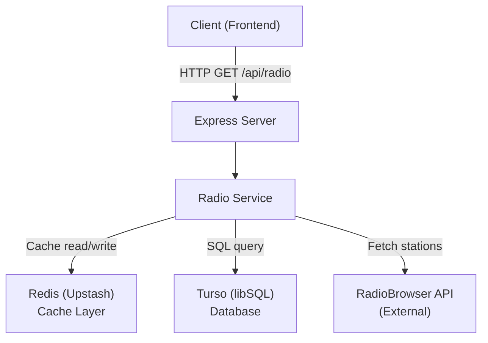
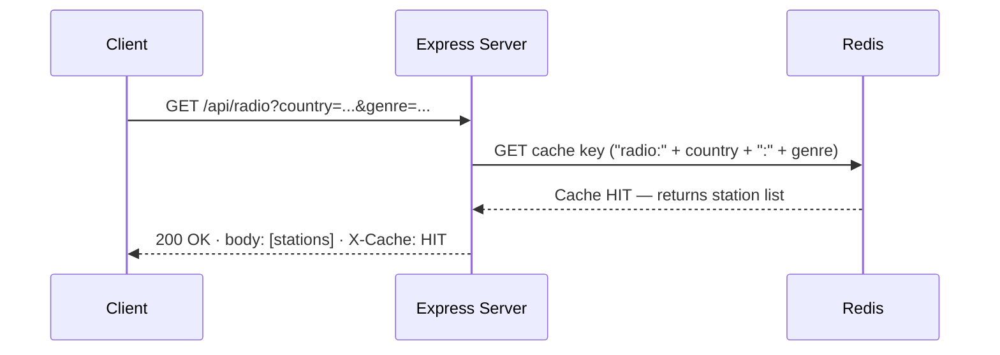
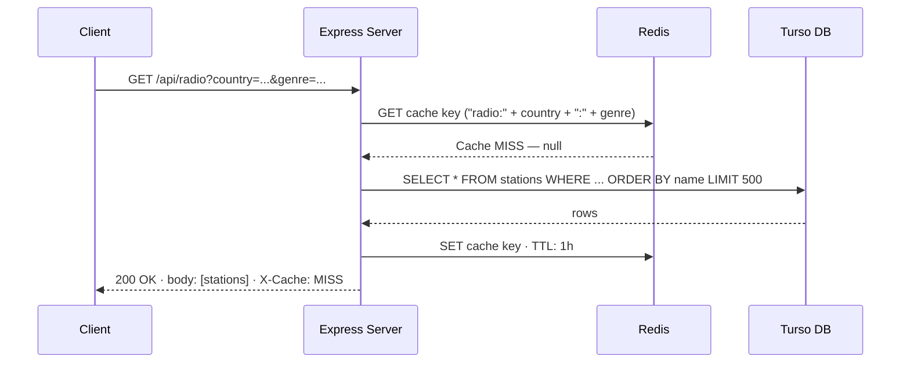
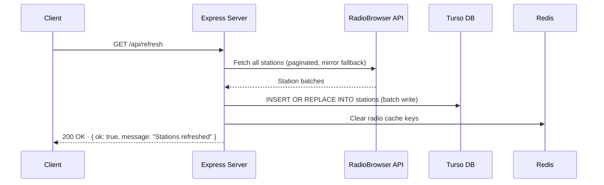

# Backend Architecture

## Overview

The backend is an Express server written in TypeScript.
It serves radio station data to the frontend by querying a Turso (libSQL) database,
with Redis (Upstash) used as a caching layer to avoid redundant database queries.

Station data is sourced from the external [RadioBrowser API](https://api.radio-browser.info/)
and is periodically refreshed into the database via a dedicated refresh endpoint.

---

## Component Diagram



---

## Request Flow — Cache HIT



---

## Request Flow — Cache MISS



---

## Request Flow — Refresh



---

## Directory Structure

```text
backend/
├── src/
│   ├── app.ts                  # Express app setup, middleware, CORS
│   ├── server.ts               # HTTP server entry point
│   ├── local.ts                # Local dev entry point
│   ├── config/
│   │   ├── env.ts              # Env var validation and export
│   │   └── config.ts           # App configuration (batch size, timeouts)
│   ├── db/
│   │   ├── db.ts               # Turso client initialisation
│   │   └── initDB.ts           # Schema creation on startup
│   ├── redis/
│   │   └── redisClient.ts      # Upstash Redis client initialisation
│   ├── routes/
│   │   ├── index.ts            # Route aggregator (/api)
│   │   ├── radio.routes.ts     # GET /api/radio — station query with caching
│   │   └── refresh.routes.ts   # GET /api/refresh — fetch + persist + cache clear
│   ├── services/
│   │   ├── radioService.ts         # Core service: fetch, save, query stations
│   │   └── radioService.instance.ts # Singleton service instance
│   └── utils/
│       ├── errorHandler.ts     # Global Express error handler
│       └── validators.ts       # Input validation helpers
├── package.json
└── tsconfig.json
```

---

## Environment Variables

| Variable             | Required | Description                        |
|----------------------|----------|------------------------------------|
| `PORT`               | No       | HTTP port (default: 5001)          |
| `FRONTEND_URL`       | Yes      | Allowed CORS origin                |
| `REDIS_URL`          | Yes      | Upstash Redis REST URL             |
| `REDIS_TOKEN`        | Yes      | Upstash Redis auth token           |
| `TURSO_DATABASE_URL` | Yes      | Turso database URL                 |
| `TURSO_AUTH_TOKEN`   | Yes      | Turso auth token                   |
